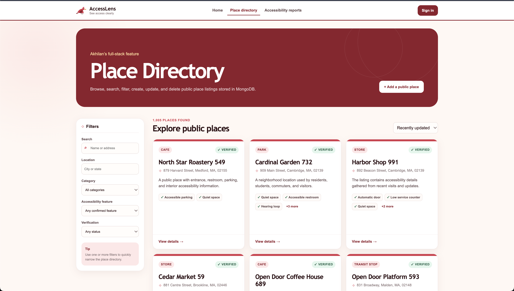

# AccessLens — Public Accessibility Report and Fix Tracker

AccessLens is a full-stack web application that helps users search, document, and manage practical accessibility information for public places such as cafés, stores, offices, parks, transit stops, libraries, and event venues.

Many websites describe a location only as “accessible” without explaining the details that matter during an actual visit. AccessLens provides specific information about ramps, elevators, step-free entrances, accessible restrooms, parking, signage, doorway width, seating, and other features. Users can also submit accessibility reports when information is missing, outdated, or incorrect.

## Live application

**Website:** REPLACE BEFORE SUBMISSION — add the public Render URL

## Demonstration video

**Video:** REPLACE BEFORE SUBMISSION — add the public narrated video URL

## Authors

- **Akhilan Anbu** — Place Directory full stack
- **Santhosh Malarvannan** — Accessibility Reports full stack

## Class

**Course:** Web Development, Summer 2026  
**Instructor:** Professor John Alexis Guerra Gomez  
**Class link:** https://northeastern.instructure.com/courses/249954

## Project objective

The objective of AccessLens is to help users make better decisions before visiting public places by providing detailed, current, and searchable accessibility information.

The application also gives community members a structured way to report accessibility barriers and allows listing creators to update the status of reports connected to their places.

## Screenshots

### Home page


### Place Directory



### Accessibility Reports


## Main features

### Place Directory — Akhilan Anbu

- Browse public place listings.
- Search by place name, address, city, or keyword.
- Filter by location, category, accessibility feature, verification status, and ownership.
- Sort places by update date or alphabetically.
- View detailed accessibility information.
- Open a place in Google Maps.
- Visit a real official website when one is available.
- Create place listings after signing in.
- Update only listings created by the signed-in user.
- Delete only listings created by the signed-in user.
- View only the current user’s listings using the ownership filter.
- Seed the database with realistic public-place records.

### Accessibility Reports — Santhosh Malarvannan

- Submit an accessibility report for a place.
- Browse recent reports.
- Filter reports by barrier type, severity, place category, and status.
- View report details.
- Edit only reports created by the signed-in user.
- Delete only reports created by the signed-in user.
- Allow a place creator to update connected report statuses.
- Support the statuses Open, In Review, Fixed, and Not Applicable.
- Seed the database with realistic barrier and report-status records.

## User personas

### Wheelchair user

Needs to check whether a place has step-free access, elevators, accessible restrooms, wide entrances, and accessible parking before visiting.

### Accessibility advocate

Wants to document accessibility barriers, explain their severity, suggest improvements, and track whether reported issues have been reviewed or fixed.

### Venue owner or listing creator

Wants to maintain accurate accessibility information for a place and respond to reports connected to that listing.

## Technology stack

| Layer | Technology |
| --- | --- |
| Frontend | React with Hooks, ReactDOM, PropTypes, Fetch API, Vite |
| Backend | Node.js and Express |
| Database | MongoDB using the native Node.js driver |
| Authentication | Passport Local and Express Session |
| Code quality | ESLint and Prettier |
| Deployment | Render |
| License | MIT |

The project does **not** use Axios, Mongoose, the CORS package, server-side rendering, or template engines.

## MongoDB collections

### `users`

Stores Passport account information:

- `_id`
- `name`
- `email`
- `passwordHash`
- `createdAt`
- `updatedAt`

### `places`

Stores public-place information:

- `_id`
- `name`
- `category`
- `address`
- `accessibilityFeatures`
- `description`
- `contact`
- `verificationStatus`
- `createdBy`
- `createdAt`
- `updatedAt`

### `reports`

Stores accessibility reports:

- `_id`
- `placeId`
- `barrierType`
- `severity`
- `description`
- `suggestedFix`
- `status`
- `createdBy`
- `createdAt`
- `updatedAt`

## Authentication and ownership

Passport Local is used for registration and sign-in. Express sessions preserve the authenticated user between requests.

Passwords are salted and hashed with Node.js `crypto.scrypt`.

Ownership checks are enforced on the server:

- Only a place creator can edit or delete that place.
- Only a report creator can edit or delete that report.
- Only the creator of a place can update the status of reports connected to that place.

The frontend hides unavailable actions, but the backend independently verifies ownership before any protected update or delete operation.

## Project structure

```text
accesslens-project3/
├── client/
│   ├── public/
│   └── src/
│       ├── api/
│       ├── assets/
│       ├── components/
│       ├── hooks/
│       └── utils/
├── server/
│   ├── scripts/
│   │   └── seed.js
│   └── src/
│       ├── config/
│       ├── middleware/
│       ├── routes/
│       └── utils/
├── docs/
│   ├── screenshots/
│   ├── mockups/
│   └── design-document.md
├── LICENSE
├── README.md
├── package.json
└── render.yaml
```

## Local setup

### Prerequisites

Install:

- Node.js 22 LTS or newer
- npm
- Git
- A MongoDB Atlas account

### 1. Clone the repository

```bash
git clone REPLACE_BEFORE_SUBMISSION_WITH_GITHUB_URL
cd accesslens-project3
```

### 2. Install dependencies

```bash
npm run install:all
```

### 3. Configure environment variables

Copy the environment example:

```bash
cp server/.env.example server/.env
```

Windows PowerShell:

```powershell
Copy-Item server/.env.example server/.env
```

Update `server/.env`:

```env
MONGO_URI=your-mongodb-atlas-connection-string
DATABASE_NAME=accesslens
SESSION_SECRET=replace-with-a-long-random-value
PORT=3000
NODE_ENV=development
```

Never commit `server/.env`.

### 4. Seed MongoDB

```bash
npm run seed -- --reset
```

The final seed should create at least 1,000 synthetic records across the application.

### 5. Run locally

Terminal 1:

```bash
npm --prefix server run dev
```

Terminal 2:

```bash
npm --prefix client run dev
```

Open:

```text
http://localhost:5173
```

The backend health endpoint is available at:

```text
http://localhost:3000/api/health
```

## Quality checks

Run:

```bash
npm run format
npm run check
```

The quality check should:

- Run ESLint for the backend.
- Run ESLint for the frontend.
- Build the React production bundle.
- Finish without errors.

## API routes

### Authentication

| Method | Route | Purpose |
| --- | --- | --- |
| GET | `/api/auth/me` | Return the current Passport user |
| POST | `/api/auth/register` | Register and sign in |
| POST | `/api/auth/login` | Sign in |
| POST | `/api/auth/logout` | End the current session |

### Places

| Method | Route | Purpose |
| --- | --- | --- |
| GET | `/api/places` | Search, filter, sort, and paginate places |
| GET | `/api/places/:id` | Read one place |
| POST | `/api/places` | Create a place |
| PUT | `/api/places/:id` | Update an owned place |
| DELETE | `/api/places/:id` | Delete an owned place |

### Accessibility reports

| Method | Route | Purpose |
| --- | --- | --- |
| GET | `/api/reports` | Search, filter, sort, and paginate reports |
| GET | `/api/reports/:id` | Read one report |
| POST | `/api/reports` | Create a report |
| PUT | `/api/reports/:id` | Update an owned report |
| DELETE | `/api/reports/:id` | Delete an owned report |
| PATCH | `/api/reports/:id/status` | Update report status as the related place owner |

## Render deployment

1. Push the project to GitHub.
2. In Render, create a Blueprint from the repository.
3. Select the root `render.yaml`.
4. Add `MONGO_URI` as a secret environment variable.
5. Confirm `DATABASE_NAME=accesslens`.
6. Allow Render to generate or store `SESSION_SECRET`.
7. Deploy the service.
8. Test the public application and `/api/health`.
9. Confirm registration, login, CRUD, ownership, direct-page refreshes, and both collections work in production.

In production, Express serves the React build from `client/dist`, so the frontend and API use the same origin.

## Accessibility and usability

The interface uses:

- Semantic HTML elements.
- Real buttons for actions.
- Labels connected to form controls.
- Keyboard-accessible controls.
- Visible focus states.
- Clear loading, empty, success, and error states.
- Responsive layouts for desktop and mobile.
- Text labels in addition to icons.
- High-contrast red, cream, and dark-text styling.

## Code organization

- Each major React component is stored in its own file.
- Each styled component imports its own CSS file.
- Backend routes, middleware, configuration, and utilities are separated.
- Database access uses the native MongoDB driver.
- Reusable frontend API and formatting utilities are separated from components.
- PropTypes are defined for collection-rendering React components.

## AI-use disclosure

Generative AI was used as a development assistant for initial structure, debugging, documentation support and to make this README.md file. The team reviewed, tested, modified the entire working model of this project.

## License

This project is available under the [MIT License](./LICENSE).
