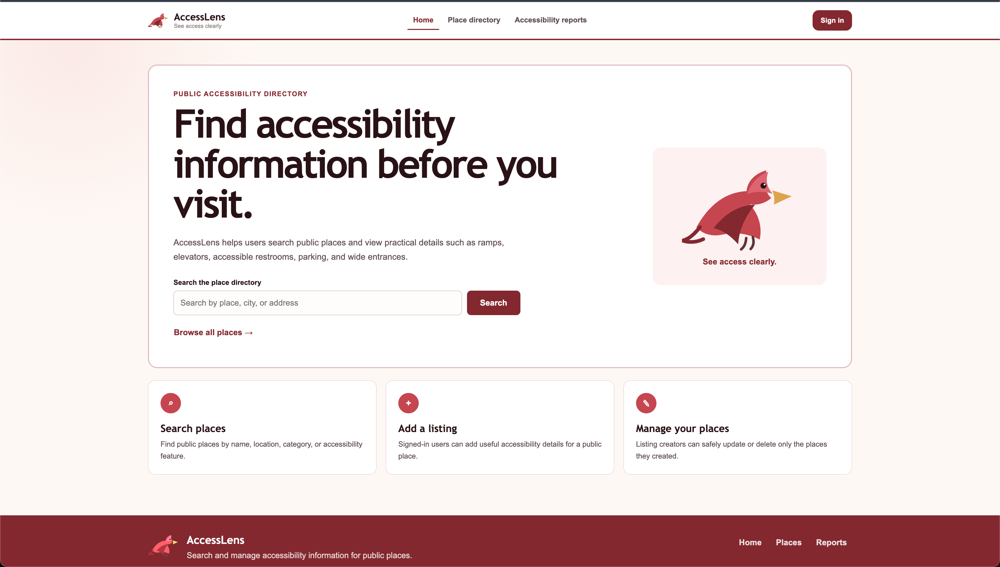
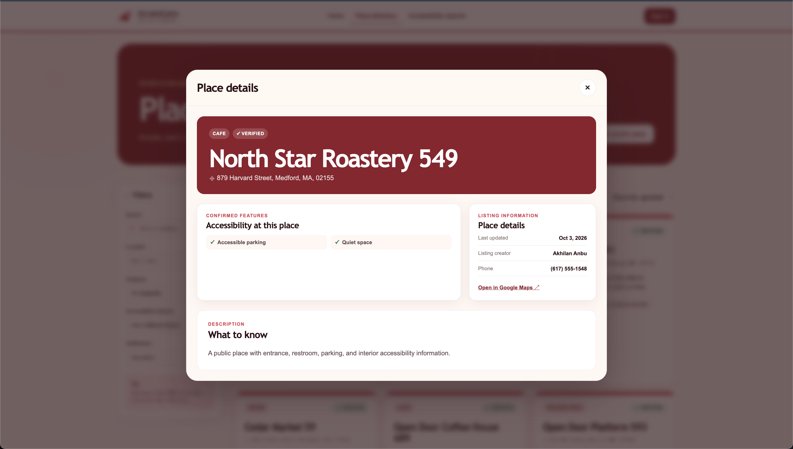
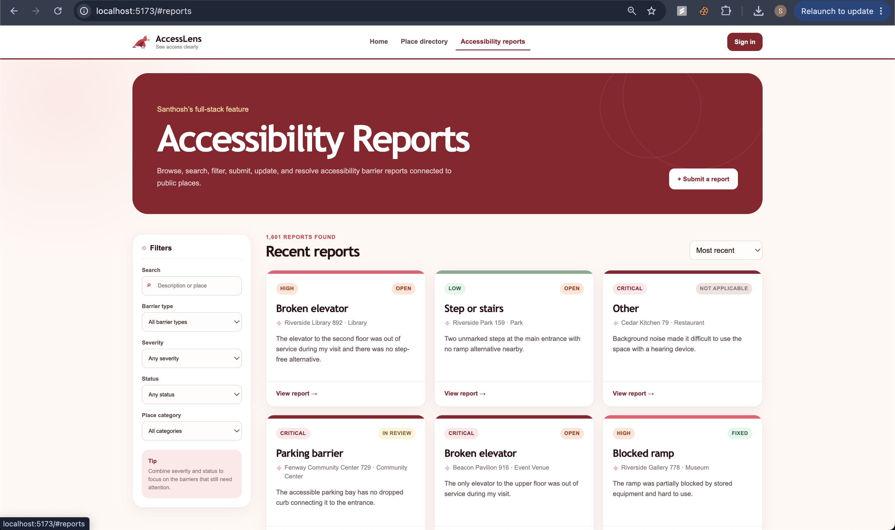
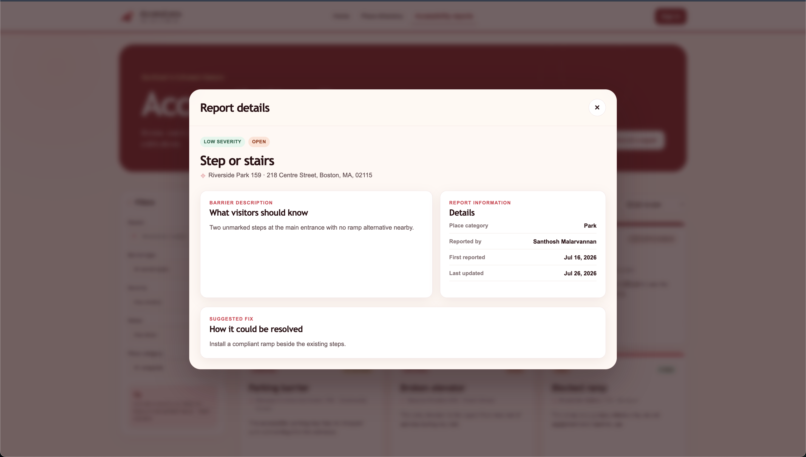

# AccessLens Design Document

**Project:** AccessLens — Public Accessibility Report and Fix Tracker  
**Team:** Akhilan Anbu and Santhosh Malarvannan  
**Course:** Web Development, Summer 2026  
**Instructor:** Professor John Alexis Guerra Gomez

## 1. Project description

AccessLens is a full-stack web application for documenting, searching, and updating accessibility information about public places.

The application focuses on practical details that are often missing from ordinary listings. A location may be described as accessible while still having blocked ramps, narrow entrances, broken elevators, inaccessible restrooms, poor signage, limited seating space, or confusing layouts.

AccessLens allows users to:

- Search for detailed accessibility information before visiting a place.
- Add a public place that is missing from the directory.
- Update information for a listing they created.
- Submit accessibility reports when they encounter a barrier.
- Track whether a report is Open, In Review, Fixed, or Not Applicable.
- View recent reports connected to a place.

## 2. Problem statement

Public accessibility information is frequently incomplete, outdated, or too general to support real decisions.

Users need more than a single “accessible” label. They need specific information about entrances, ramps, elevators, restrooms, parking, seating, signage, and current barriers.

Venue owners and community contributors also need a structured way to correct information and respond to accessibility concerns without allowing unrelated users to modify or remove records they do not own.

## 3. Project goals

The project has five main goals:

1. Provide detailed, searchable accessibility information.
2. Protect community data through authentication and ownership checks.
3. Let users report current barriers and suggested fixes.
4. Make the interface usable on desktop and mobile.
5. Keep the two teammates’ features independent while integrating them into one application.

## 4. User personas

### Persona 1 — Wheelchair user

**Name:** Maya  
**Goal:** Decide whether she can comfortably enter and use a place before travelling there.  
**Needs:**

- Step-free entrance
- Ramp availability
- Elevator availability
- Wide entrances
- Accessible restroom
- Accessible parking
- Recent updates

**Frustration:** General labels such as “wheelchair accessible” do not explain whether the elevator works or whether the restroom is usable.

### Persona 2 — Accessibility advocate

**Name:** Daniel  
**Goal:** Document barriers and track whether they are reviewed or fixed.  
**Needs:**

- Report form
- Barrier categories
- Severity levels
- Suggested fix
- Report status
- Recent reports

**Frustration:** Existing review websites mix accessibility concerns with unrelated reviews and provide no structured status tracking.

### Persona 3 — Venue owner or listing creator

**Name:** Priya  
**Goal:** Keep her venue’s accessibility information accurate and respond to connected reports.  
**Needs:**

- Ownership-based editing
- Ownership-based deletion
- Report status controls
- Clear place details
- Contact and website fields

**Frustration:** She needs to correct outdated information without allowing unrelated users to change her listing.

## 5. User stories

## 5.1 Place Directory — Akhilan Anbu

### Create place

As a signed-in community contributor, I want to create a public-place listing so that useful accessibility information is available to other visitors.

### Browse and search places

As a visitor, I want to browse and search places by name, city, address, and category so that I can quickly find a relevant location.

### Filter places

As a visitor, I want to filter places by accessibility feature and verification status so that I can compare locations based on my needs.

### View place details

As a visitor, I want to view specific accessibility features, contact information, address, update date, and map links so that I can plan my visit.

### Update owned place

As a listing creator, I want to update only a place I created so that I can correct accessibility information without changing someone else’s record.

### Delete owned place

As a listing creator, I want to delete only a place I created so that unrelated users cannot remove shared community records.

## 5.2 Accessibility Reports — Santhosh Malarvannan

### Create report

As a signed-in user, I want to submit an accessibility report for a place so that other visitors know about a current barrier.

### Browse and filter reports

As a visitor, I want to filter reports by barrier type, severity, place category, and status so that I can focus on relevant issues.

### View recent reports

As a visitor, I want to view recent reports connected to a place so that I can judge whether the place information is current.

### Update owned report

As a report creator, I want to edit my own report so that I can correct a mistake or add useful details.

### Delete owned report

As a report creator, I want to delete my own report so that incorrect or duplicate information can be removed.

### Update report status

As a place creator, I want to update the status of reports connected to my listing so that users can see whether an issue is Open, In Review, Fixed, or Not Applicable.

## 6. Work division

## Akhilan Anbu — Place Directory full stack

- React place-directory components
- Place search, filters, sorting, and pagination
- Place cards and place details
- Create and edit place form
- Express place routes
- Native MongoDB place CRUD
- Passport ownership checks for places
- Place seed data
- Place-specific CSS and testing

## Santhosh Malarvannan — Accessibility Reports full stack

- React report components
- Report search, filters, sorting, and status controls
- Report cards and report details
- Create and edit report form
- Express report routes
- Native MongoDB report CRUD
- Ownership checks for reports
- Place-owner report-status updates
- Report seed data
- Report-specific CSS and testing

## Shared responsibilities

- Passport authentication
- Homepage and navigation
- MongoDB Atlas configuration
- Deployment
- README and design documentation
- ESLint and Prettier
- Demo video
- Final integration testing

## 7. Information architecture

```text
Home
├── Search places
├── Browse Place Directory
├── Sign in / Register
└── Learn how AccessLens works

Place Directory
├── Search and filters
├── Sort controls
├── Place cards
├── Pagination
├── Add place
└── Place details
    ├── Accessibility features
    ├── Address and map
    ├── Contact information
    ├── Edit owned place
    ├── Delete owned place
    └── Related accessibility reports

Accessibility Reports
├── Search and filters
├── Report cards
├── Pagination
├── Add report
└── Report details
    ├── Barrier type
    ├── Severity
    ├── Description
    ├── Suggested fix
    ├── Status
    ├── Edit owned report
    ├── Delete owned report
    └── Update status as place owner

Account
├── Register
├── Sign in
├── Sign out
└── Current-user information
```

## 8. Design system

## 8.1 Visual theme

The interface uses a red-bird theme with a simple student-made appearance.

### Primary colors

- Deep red for headings, buttons, borders, and navigation
- Warm cream for page backgrounds
- White for cards and forms
- Dark brown-red for readable body text
- Green only for positive verification or success indicators

### Visual principles

- Clear hierarchy
- Limited decorative effects
- Large readable headings
- Rounded cards and form fields
- Consistent spacing
- Text labels in addition to icons
- Responsive layouts

## 8.2 Typography

- Display font for major headings
- Sans-serif font for forms, navigation, cards, and body text
- Strong labels and readable line height
- No text placed over low-contrast backgrounds

## 8.3 Interaction patterns

- Buttons use standard `<button>` elements.
- Navigation uses links or buttons depending on behavior.
- Forms use labels connected to inputs.
- Modals have visible close buttons.
- Loading, empty, success, and error states are shown.
- Destructive actions require clear confirmation.
- Disabled actions are visibly distinct.
- Keyboard focus states remain visible.

## 9. Design mockups

The final repository must include actual image files in:

```text
docs/mockups/
├── home-mockup.png
├── places-mockup.png
├── place-detail-mockup.png
├── reports-mockup.png
└── report-detail-mockup.png
```

### Home page mockup



**Purpose:**

- Introduce the application.
- Provide one clear place-search action.
- Provide a browse-directory action.
- Explain the Search, Add, and Manage workflow.
- Display the red-bird visual identity without making the page overly complex.

### Place Directory mockup


**Purpose:**

- Display search and filter controls.
- Show paginated place cards.
- Provide sorting.
- Allow signed-in users to add a place.
- Keep filters understandable on desktop and mobile.

### Place Detail mockup



**Purpose:**

- Show accessibility features.
- Show verification status.
- Show contact and website information.
- Provide Google Maps access.
- Display edit and delete controls only to the owner.
- Show related recent reports.

### Accessibility Reports mockup



**Purpose:**

- Display report search and filters.
- Show barrier type, severity, status, place, and date.
- Provide an add-report action.
- Support pagination.

### Report Detail mockup



**Purpose:**

- Show the complete report.
- Display suggested fix and status.
- Show edit and delete controls to the report owner.
- Show report-status controls to the related place owner.


## 10. React component plan

## Shared components

- `App`
- `Header`
- `Hero`
- `AccountPanel`
- `AuthModal`
- `Modal`
- `Pagination`
- `EmptyState`
- `Toast`
- `Footer`

## Place components

- `PlaceDirectory`
- `PlaceFilters`
- `PlaceCard`
- `PlaceDetail`
- `PlaceForm`

## Report components

- `ReportDirectory`
- `ReportFilters`
- `ReportCard`
- `ReportDetail`
- `ReportForm`
- `ReportStatusControl`

Each collection-rendering component defines PropTypes. Each styled component imports its own CSS file.

## 11. MongoDB data design

## 11.1 `users`

```js
{
  _id: ObjectId,
  name: String,
  email: String,
  passwordHash: String,
  createdAt: Date,
  updatedAt: Date
}
```

## 11.2 `places`

```js
{
  _id: ObjectId,
  name: String,
  category: String,
  address: {
    street: String,
    city: String,
    state: String,
    postalCode: String,
    country: String
  },
  accessibilityFeatures: [String],
  description: String,
  contact: {
    phone: String,
    website: String
  },
  verificationStatus: String,
  createdBy: ObjectId,
  createdAt: Date,
  updatedAt: Date
}
```

## 11.3 `reports`

```js
{
  _id: ObjectId,
  placeId: ObjectId,
  barrierType: String,
  severity: String,
  description: String,
  suggestedFix: String,
  status: String,
  createdBy: ObjectId,
  createdAt: Date,
  updatedAt: Date
}
```

## 12. Relationships

- One user can create many places.
- One user can create many reports.
- One place can have many reports.
- A place stores its creator in `createdBy`.
- A report stores its creator in `createdBy`.
- A report references its related place through `placeId`.

## 13. API design

## Authentication routes

| Method | Route | Authentication | Purpose |
| --- | --- | --- | --- |
| GET | `/api/auth/me` | Optional | Return current user |
| POST | `/api/auth/register` | No | Register and sign in |
| POST | `/api/auth/login` | No | Sign in |
| POST | `/api/auth/logout` | Yes | Sign out |

## Place routes

| Method | Route | Authentication | Purpose |
| --- | --- | --- | --- |
| GET | `/api/places` | Optional | Search, filter, sort, and paginate |
| GET | `/api/places/:id` | Optional | Read one place |
| POST | `/api/places` | Yes | Create owned place |
| PUT | `/api/places/:id` | Place owner | Update owned place |
| DELETE | `/api/places/:id` | Place owner | Delete owned place |

## Report routes

| Method | Route | Authentication | Purpose |
| --- | --- | --- | --- |
| GET | `/api/reports` | Optional | Search, filter, sort, and paginate |
| GET | `/api/reports/:id` | Optional | Read one report |
| POST | `/api/reports` | Yes | Create owned report |
| PUT | `/api/reports/:id` | Report owner | Update owned report |
| DELETE | `/api/reports/:id` | Report owner | Delete owned report |
| PATCH | `/api/reports/:id/status` | Related place owner | Update report status |

Update this table if the final implementation uses equivalent route names.

## 14. Authentication and authorization design

Passport Local authenticates users with email and password.

The user ID is stored in the session and restored on future requests.

### Place rules

- Anyone can read places.
- A signed-in user can create a place.
- Only the creator can update a place.
- Only the creator can delete a place.

### Report rules

- Anyone can read reports.
- A signed-in user can create a report.
- Only the report creator can edit a report.
- Only the report creator can delete a report.
- Only the related place creator can update the report status.

The backend enforces all protected actions even if a user manually sends an API request.

## 15. Search, filtering, and pagination

## Place Directory

Search fields:

- Name
- Address
- City
- Keyword

Filters:

- Category
- Location
- Accessibility feature
- Verification status
- Only places created by current user

Sort options:

- Recently updated
- Name A to Z
- Name Z to A

## Accessibility Reports

Search fields:

- Place name
- Barrier description
- Suggested fix

Filters:

- Barrier type
- Severity
- Place category
- Status
- Only reports created by current user

Sort options:

- Most recent
- Oldest
- Highest severity

Both collections use server-supported pagination.

## 16. Validation and error handling

### Client-side validation

- Required fields are clearly marked.
- Forms reject empty required values.
- Website fields require valid URLs when present.
- Severity and status use controlled options.
- Error messages appear near the relevant form or in a toast.

### Server-side validation

- Request bodies are validated independently of the frontend.
- MongoDB IDs are validated before use.
- Unknown records return 404 responses.
- Unauthenticated protected requests return 401 responses.
- Ownership violations return 403 responses.
- Invalid values return 400 responses.
- Unexpected errors return a safe 500 response.

## 17. Accessibility considerations

- Semantic HTML is used.
- Buttons are implemented with `<button>`.
- Form labels are connected to controls.
- Keyboard users can reach all interactive elements.
- Visible focus styles are retained.
- Color is not the only way status is communicated.
- Images include appropriate alternative text.
- Modals have clear close controls.
- Text contrast is checked.
- Layouts remain usable at smaller widths.

## 18. Seed-data plan

The final database contains at least 1,000 synthetic records.

Planned distribution:

- 1,005 or more places
- 1,000 or more reports
- Several demo users

Place records vary by:

- Category
- City
- Accessibility features
- Verification status
- Contact information

Report records vary by:

- Barrier type
- Severity
- Status
- Description
- Suggested fix
- Related place
- Creation date

## 19. Testing plan

## Authentication

- Register
- Sign in
- Sign out
- Restore session
- Reject incorrect password

## Places

- Create place
- Read list and details
- Search and filter
- Sort and paginate
- Update owned place
- Reject update by unrelated user
- Delete owned place
- Reject delete by unrelated user

## Reports

- Create report
- Read list and details
- Search and filter
- Sort and paginate
- Update owned report
- Reject update by unrelated user
- Delete owned report
- Reject delete by unrelated user
- Update status as related place owner
- Reject status change by unrelated user

## Deployment

- Public homepage loads
- API health route works
- Direct refresh does not return 404
- MongoDB data loads
- Authentication works in production
- Both CRUD collections work in production
- Mobile layout works

## 20. Deployment architecture

```text
Browser
  |
  | HTTPS
  v
Render Web Service
  |
  |-- Express API
  |-- Passport and sessions
  |-- React production files from client/dist
  |
  v
MongoDB Atlas
```

The React application and Express API share one origin in production, so no CORS package is needed.

## 22. AI-use disclosure

Generative AI was used for the initial structure, debugging and documentation support. The team reviewed, tested, modified the entire model of the project.